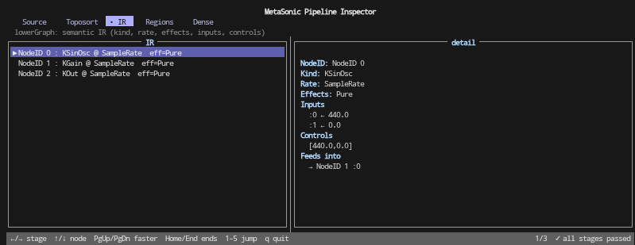

# MetaSonic Bridge

Graph compiler and FFI layer for the MetaSonic audio system.

MetaSonic is a research project exploring compiler architecture for real-time
signal graphs with deterministic execution semantics. This repository —
`metasonic-bridge` — is a prototype implementation of its core pipeline:
representing audio graphs in a strongly typed IR, stripping redundant nodes,
and marshaling the result across a thin FFI boundary into C++.

The source is documented with Haddock comments and cross-reference notes that
cover significantly more detail than this file. For a conceptual picture of the
system, read the code in pipeline order starting from
[`src/MetaSonic/Types.hs`](./src/MetaSonic/Types.hs).

For deeper design discussion and reasoning, see the [blog](https://smoge.github.io/metasonic-bridge).

```
Haskell DSL → SynthGraph → GraphIR → RuntimeGraph → DSP Engine
```

No symbolic lookups in the audio thread. No runtime graph solving.
Everything is resolved before the C++ layer sees it.

---

## Motivation

At this development stage, graph building is a compiler problem. DSP is a
runtime problem. Two worlds:

- **Haskell** — builds, analyzes, compiles
- **C++20** — executes DSP, deterministic and strict

You don't evaluate structure at runtime. You build, validate, order, compile —
then execute. When audio starts, decisions are already made.

Note: graphs and instances can be added, modified, or removed at runtime
without restarting audio. Voice templates declare polyphony at load time and
the C runtime pre-warms an instance pool; new voices are reserved off-thread
and activated on the audio thread without allocation. See the
`rt_graph_realtime_*` surface in [tinysynth/rt_graph.h](tinysynth/rt_graph.h).

---

## Architecture

`metasonic-bridge` is one layer of a larger system. Each layer can be developed
and tested independently:

```
metasonic-core       future DSL — no C++ dependencies, pure Haskell
     ↓
metasonic-bridge     graph compiler + FFI + authoring helpers + TUI inspector
     ↓
tinysynth            real-time audio engine — pure C++20 + q_lib
     ↓
tinysynth-ui         runtime-facing UI on the C++ side
```

- **metasonic-core** is the future home for the user-facing DSL. No FFI
  involvement. Type discipline is the bridge's responsibility, not the DSL's.
- **metasonic-bridge** compiles graphs into a strongly typed IR and
  marshals across the FFI boundary. It also carries the current
  `MetaSonic.Authoring` facade: a transparent authoring layer that elaborates
  back to ordinary `SynthGraph` / `TemplateGraph` values.
- **tinysynth** is the audio engine. Plugins are authored and tested entirely in
  C++ — no Haskell toolchain required.
- **tinysynth-ui** provides real-time parameter control and audio visualization
  through Dear ImGui. It links tinysynth directly for the hot path (knobs,
  meters, FFT display) and `dlopen`s the bridge shared library for structural
  operations (graph editing, recompilation).

The modules in this repository roughly correspond to stages in the compilation
pipeline. The bridge requires that the Haskell and C++ sides stay in sync —
particularly when new tinysynth plugins are introduced — though there are plans
to derive more of this synchronization from plugin metadata.

As the system stabilizes, all layers will live in a single monorepo while
keeping their architectural modularity. This repo layout is temporary.

---

## Quick start

### Requirements

- **GHC** — tested with 9.10.3
- **Stack** — deterministic dependency management
- **C++20 compiler** — GCC or Clang
- **PortAudio / PortMIDI** — must be installed separately on your system
- **Q** (C++20 library) — infra and q_lib modules, included as git
  submodules

### Build and run

```sh
git clone --recurse-submodules https://github.com/smoge/metasonic-bridge.git
cd metasonic-bridge
stack build
stack exec metasonic-bridge
```

---

## Usage

The executable supports audio playback, inspection, and non-audio reporting
modes. Most modes accept optional demo targets.

```
stack exec -- metasonic-bridge [MODE] [DEMO ...]
```

### Run modes

| Flag                          | Behavior                                      |
|-------------------------------|-----------------------------------------------|
| *(default)* / `--audio-only`  | Compile and play audio directly               |
| `--inspect`                   | Open the TUI inspector, then play audio       |
| `--inspect-only`              | Open the TUI inspector and skip audio         |
| `--fusion-survey`             | Report fusion, schedule, rate, and gate data  |
| `--worker-bench`              | Benchmark schedule worker dispatch modes      |
| `--swap-bench`                | Benchmark the hot-swap helper path            |
| `--corpus-survey`             | Run the pattern corpus through survey tooling |
| `--fusion-cost-lab [--summary]` | Measure fusion variants and equivalence     |
| `--snapshot-check`            | Run survey / cost-lab invariant checks        |
| `--authoring-manifest`        | Emit JSON manifest of authoring metadata      |
| `--manifest-reload-plan DEMO` | Diagnose manifest reload planning             |
| `--manifest-reload-plan-file MANIFEST.json DEMO` | Diagnose external manifest planning |
| `--manifest-session-smoke MANIFEST.json DEMO` | Construct a fresh owner from a manifest |
| `--midi-list`                 | List Q / PortMIDI devices                     |
| `--session-midi-smoke [SECONDS]` | Probe session MIDI ingress without audio   |
| `--plugin-list`               | Print the linked static plugin registry       |
| `--osc-listen [PORT]`         | Run the OSC-controlled demo graph             |

Useful modifiers:

- `--fused` selects the fused-input loader path for applicable demo modes.
- `--summary` switches `--fusion-cost-lab` from JSONL to a readable table.
- `--midi-device N` selects the PortMIDI input for `midi-poly` and
  overrides the auto-selected input for `--session-midi-smoke`.

### Demo targets

If no demo names are given, all available demos run in sequence.

To list the available `SynthGraph`s, run:

```sh
stack exec -- metasonic-bridge --help
```

### Examples

```sh
# Play all (audio only)
stack exec -- metasonic-bridge

# Play a specific SynthGraph
stack exec -- metasonic-bridge chain

# Inspect a graph with TUI, then play audio
stack exec -- metasonic-bridge --inspect chain

# Inspect all graphs with no audio
stack exec -- metasonic-bridge --inspect-only

# Inspect a specific graph
stack exec -- metasonic-bridge --inspect-only fanout

# Human-readable fusion cost-lab summary
stack exec -- metasonic-bridge --fusion-cost-lab --summary

# Run the structural snapshot checks
stack exec -- metasonic-bridge --snapshot-check

# Emit a JSON manifest of authoring metadata for one demo
stack exec -- metasonic-bridge --authoring-manifest send-return

# Print the built-in diagnostic reload plan for an authored demo
stack exec -- metasonic-bridge --manifest-reload-plan send-return

# Validate an external manifest JSON file against the built-in catalog
stack exec -- metasonic-bridge --manifest-reload-plan-file manifest.json send-return

# Construct a fresh non-audio session owner from an external manifest
stack exec -- metasonic-bridge --manifest-session-smoke manifest.json send-return

# Run the OSC control demo on UDP port 7000
stack exec -- metasonic-bridge --osc-listen 7000

# Probe the session MIDI ingress path for 10 seconds
stack exec -- metasonic-bridge --session-midi-smoke 10

# Probe a specific input-capable MIDI device
stack exec -- metasonic-bridge --midi-device 2 --session-midi-smoke 10
```

### Compilation inspector (TUI)

The `--inspect` and `--inspect-only` flags launch a terminal UI built with brick
that lets you step through every stage of the compilation pipeline for each demo
graph. When using `--inspect`, the inspector runs for each demo graph in
sequence. After exiting the inspector (`q` or `Esc`), a compilation summary
prints to stdout and audio begins. With `--inspect-only`, audio is skipped
entirely.



---

## Authoring layer

`MetaSonic.Authoring` is the current bridge-local authoring facade. It adds
typed mono/stereo/channel wrappers, lifted UGen helpers, routing helpers, and
an ensemble builder, but it does not add runtime concepts. Every helper
elaborates to ordinary primitive `SynthGraph` or `TemplateGraph` input.

The ensemble builder is useful for multi-template patches because it gives
shared buses stable names instead of hard-coded integers:

```haskell
-- import qualified MetaSonic.Authoring as Auth

sendReturnEnsemble :: Auth.AuthoredEnsemble
sendReturnEnsemble = either error id $ Auth.ensemble $ do
  sendBus <- Auth.busNamed "main-send"

  Auth.voice "voice" $ runSynth $ do
    osc <- sawOsc 110.0 0.0
    g   <- gain osc 0.4
    Auth.send sendBus (Auth.mono g)

  Auth.fx "fx" $ runSynth $ do
    sent <- Auth.returnBus sendBus
    f    <- Auth.lpfM sent (Param 800.0) (Param 0.7)
    Auth.outMono 0 f

sendReturnTemplates :: [(String, SynthGraph)]
sendReturnTemplates = Auth.aeTemplates sendReturnEnsemble
```

`sendReturnTemplates` is the same shape `compileTemplateGraph` already
accepts. Template ordering, bus footprints, fusion, schedule analysis, and FFI
loading still belong to the existing compiler pipeline.

---

## Session preparation APIs

The repository also carries the current Haskell-side session scaffolding under
`MetaSonic.Session.*`. This is library code, not a background service.

The landed pieces are deliberately small:

- `MetaSonic.Session.Command` normalizes producer intents into
  `SessionCommand` values.
- `MetaSonic.Session.State` admits commands, returns plans, and applies
  checked commits only after a runtime adapter reports success.
- `MetaSonic.Session.RTGraphAdapter` and `MetaSonic.Session.Owner` provide a
  caller-scoped, single-threaded owner around a real `RTGraph`, including
  supported preserving hot-swap for eligible oscillator/filter voices.
- `MetaSonic.Session.Queue` is a bounded Haskell-side producer-intent FIFO.
- `MetaSonic.Session.PatternProducer` expands one `Pattern` range at a time,
  converts `PatternEvent` values through `fromPatternEvent`, and retains a
  bounded backlog when the queue is full.
- `MetaSonic.Session.Runner` and `MetaSonic.Session.Host` compose the Pattern
  producer, queue, and owner into caller-driven and thread-safe Pattern
  stepping helpers.
- `MetaSonic.Session.FanIn` provides the generic serialized command-ingress
  host for already-formed `SessionCommand`s from concrete producers.
- `MetaSonic.Session.FanInService` adds a scoped background worker around that
  host. Successful enqueues wake one FIFO drain; stopped drains are reported,
  owner divergence terminates the worker instead of repairing the session, and
  teardown kills the worker if a service hook blocks during shutdown.
- `MetaSonic.Session.OSCProducer` translates symbolic OSC control writes of
  the form `/<voice>/<tag>/<slot>` plus one numeric argument into
  `SessionCommand`s and submits them through `MetaSonic.Session.FanIn`.
- `MetaSonic.Session.OSCListener` brackets a UDP OSC listener on top of that
  producer. It only parses and enqueues; draining is owned by the caller or by
  a composed `MetaSonic.Session.FanInService`.
- `MetaSonic.Session.MIDIProducer` translates already-decoded MIDI note-on,
  note-off, control-change, pitch-bend, and all-notes-off events into session
  commands with `ProducerMIDI` identity, including per-note producer state,
  per-channel bend replay for later note-on starts, configurable
  note/CC/pitch-bend mappings, sustain-pedal deferral/release, a default-omni
  channel allow-list, and deterministic producer-local voice stops.
- `MetaSonic.Session.MIDIListener` brackets a worker around an injected
  decoded MIDI event source, feeds `MetaSonic.Session.MIDIProducer`, and
  coalesces repeated MIDI control writes locally before fan-in. It is testable
  without hardware and still does not own PortMIDI devices.
- `MetaSonic.MIDI.Devices` centralizes Q / PortMIDI device enumeration for
  both the legacy live MIDI demo and the session MIDI smoke command.
- `MetaSonic.Session.MIDIPortMIDI` adapts a Q / PortMIDI input device into
  that decoded source shape. It opens an idle closeable source on no-device
  hosts and still leaves MIDI policy to `MetaSonic.Session.MIDIProducer`.
  The CLI also exposes `--session-midi-smoke [SECONDS]` as a repeatable
  manual probe for the PortMIDI source, decoded listener, producer, fan-in
  service, and drain path. When `--midi-device` is omitted, the smoke command
  auto-selects the first input-capable Q / PortMIDI device, reports
  listener-local coalescing counters, and separates dropped-fence reports from
  generic listener issues.
- `MetaSonic.Session.UIProducer` translates already-decoded UI intents into
  session commands with `ProducerUI` identity, rejecting non-finite UI control
  values before they enter the fan-in queue.
- `MetaSonic.Session.ManifestReload` validates decoded authoring manifests
  against a caller-owned catalog, derives static resource policy, projects
  control metadata, and emits a `CmdHotSwap` value for later install
  strategies. The CLI exposes `--manifest-reload-plan DEMO` for the built-in
  manifest document and `--manifest-reload-plan-file MANIFEST.json DEMO` for
  diagnostic external JSON validation. `--manifest-session-smoke
  MANIFEST.json DEMO` then uses that plan to construct a fresh non-audio
  `SessionOwner` and report status. `--manifest-stopped-audio-reload-smoke
  MANIFEST.json DEMO` creates an existing non-audio fan-in host and uses the
  planned manifest owner to exercise the stopped-audio reload helper. These
  paths do not start audio, enqueue producer commands, or execute `CmdHotSwap`.
- `MetaSonic.Session.ManifestReload.Runtime` exposes
  `reloadManifestSessionStoppedAudio` for the first non-audio stopped-audio
  reload helper. It takes a prevalidated plan, requires the fan-in queue to be
  empty, replaces the current owner generation, and reports that
  listener/producer brackets must restart. It does not call `startAudio` /
  `stopAudio`, validate manifests, drain queued commands, or restart listener
  threads.

What is still intentionally absent: GUI toolkit bindings, live or
host-level manifest-driven session reload/resource allocation beyond the
diagnostic planning, construction-smoke CLI, non-audio stopped-audio
owner-swap helper, and stopped-audio reload smoke CLI, broader MIDI behavior
beyond the landed
MIDI ingress surface (note/CC/sustain/pitch-bend/all-notes-off command
translation, producer-local channel filtering, and the small
PortMIDI-backed decoded source), broader OSC behavior beyond symbolic
control writes, channel
remapping/splits, MIDI clock, aftertouch, arbitration beyond FIFO,
long-running supervision beyond the scoped fan-in service, unsupported
respawn/reset policy for preserving swaps, and recovery after terminal
runtime divergence.

---

## Low-level SynthGraph syntax

The lower-level graph builder remains available directly. It looks like this
(these are some of the included demos, and each can be played or inspected via
the TUI):

```haskell
chainGraph :: SynthGraph
chainGraph = runSynth $ do
  osc <- sinOsc 440.0 0.0
  g   <- gain osc 0.5
  out 0 g

fanOutGraph :: SynthGraph
fanOutGraph = runSynth $ do
  osc <- sinOsc 440.0 0.0
  g1  <- gain osc 0.3
  g2  <- gain osc 0.7
  out 0 g1
  out 1 g2

sawGraph :: SynthGraph
sawGraph = runSynth $ do
  osc <- sawOsc 440.0 0.0
  g   <- gain osc 0.4
  out 0 g

noiseGraph :: SynthGraph
noiseGraph = runSynth $ do
  n <- noiseGen
  g <- gain n 0.15
  out 0 g

noiseLpfGraph :: SynthGraph
noiseLpfGraph = runSynth $ do
  n <- noiseGen
  f <- lpf n 800.0 0.7
  g <- gain f 0.4
  out 0 g

filteredSawGraph :: SynthGraph
filteredSawGraph = runSynth $ do
  osc <- sawOsc 110.0 0.0
  f   <- lpf osc 1200.0 1.5
  g   <- gain f 0.6
  out 0 g

detunedSawGraph :: SynthGraph
detunedSawGraph = runSynth $ do
  osc1 <- sawOsc 220.0 0.0
  osc2 <- sawOsc 220.5 0.5
  g1   <- gain osc1 0.3
  g2   <- gain osc2 0.3
  out 0 g1
  out 0 g2

-- Voice template: write to a bus instead of straight to output.
voiceGraph :: SynthGraph
voiceGraph = runSynth $ do
  osc <- sawOsc 110.0 0.0
  g   <- gain osc 0.4
  busOut 7 g

-- Master template: read the same bus, apply shared FX, write to output.
masterGraph :: SynthGraph
masterGraph = runSynth $ do
  r <- busIn 7
  f <- lpf r 1200.0 1.5
  g <- gain f 0.8
  out 0 g

```

Inter-template precedence (voice runs before master) is derived automatically
from the `busOut 7` / `busIn 7` connectivity at compile time — there is no
runtime ordering knob.

This low-level syntax belongs to `metasonic-bridge` — the compilation layer
that constructs IR nodes and lowers them to C++. The `MetaSonic.Authoring`
facade sits above it for common authoring patterns while preserving the same
lowered graph shape.

---

## Current state

- Block-based DSP execution
- Static, precompiled graphs and multi-template `TemplateGraph`s
- DSP layer grounded on q_lib
- Authoring helpers for mono/stereo/channel expansion, routing, and ensembles
- Static plugin metadata registry shared across Haskell and C++
- OSC listener / dispatcher for the current v1 control surface
- Hand-written fusion kernels plus read-only generated-fusion experiments
- TUI inspector for stepping through compilation stages
- Survey, benchmark, cost-lab, and snapshot-check modes for regression evidence
