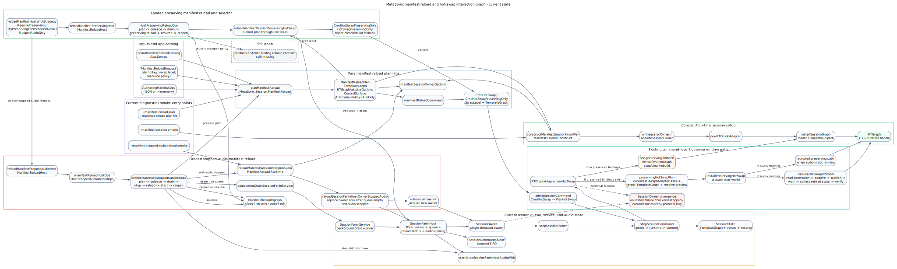

# Hot-Swap Reload Current Interaction Graph

Date: 2026-05-15

Status: architecture diagram. This note records how the current manifest
reload, session owner, fan-in, and hot-swap pieces interact as of this
checkout. It does not propose new semantics beyond the gaps explicitly marked
as not landed.

Graph source:
[`2026-05-15-b-hot-swap-reload-current-interaction-graph.dot`](./2026-05-15-b-hot-swap-reload-current-interaction-graph.dot)

## Reading The Graph

The solid paths are implemented today:

- `MetaSonic.Session.ManifestReload` validates an `AuthoringManifestDoc`
  against the app catalog and builds a `ManifestReloadPlan`.
- `manifestReloadCommand` projects that plan into the existing `CmdHotSwap`
  command shape.
- `constructManifestSessionFromPlan` constructs a fresh owner from a plan. It
  is construction-time only and does not reload an existing owner.
- `reloadManifestSessionStoppedAudio` is the landed session-layer stopped-audio
  helper. It replaces the fan-in host owner only after the caller has stopped
  audio, quiesced producers/listeners, and drained accepted queue work.
- `reloadManifestStoppedAudioHost` wires the app-level stopped-audio sequence:
  plan, quiesce ingress, drain, stop old audio, replace owner, start new audio,
  and reopen ingress.
- `CmdHotSwap` already reaches the real `RTGraphAdapter.runHotSwap` path
  through `SessionState`, `stepSessionCommand`, and `stepSessionOwner`.
- When the resolve preview has preserved bindings, `runHotSwap` uses
  `preservingHotSwapPlan` and then the preserving runtime path. If audio is
  running, `runLiveHotSwapProtocol` pins the order: read generation, acquire,
  publish, wait, collect retired stats, and verify migration.

The dashed nodes are not landed yet:

- a preserving-only command or strategy bit that cannot fall back to
  stop/clear/rebuild;
- `reloadManifestSessionPreservingHotSwap`;
- `HostPreservingReloadOps`;
- a host-level strategy selector that can prefer preserving and explicitly
  fall back to stopped-audio;
- the producer/listener binding rebuild contract after a successful preserving
  manifest swap.

## Current Boundary To Keep Clear

The stopped-audio path is an implemented sibling strategy. It is not the live
preserving path. The preserving manifest path should consume the same
`ManifestReloadPlan`, but it needs its own named helper and orchestration shape
so it cannot quietly call the stopped-audio owner replacement path.

The most important implementation gap remains the preserving-only manifest path:
project a validated plan into a hot-swap command while preserving the existing
publish / wait / collect / verify / commit contract and rejecting unsupported
shapes before they mutate runtime state.
